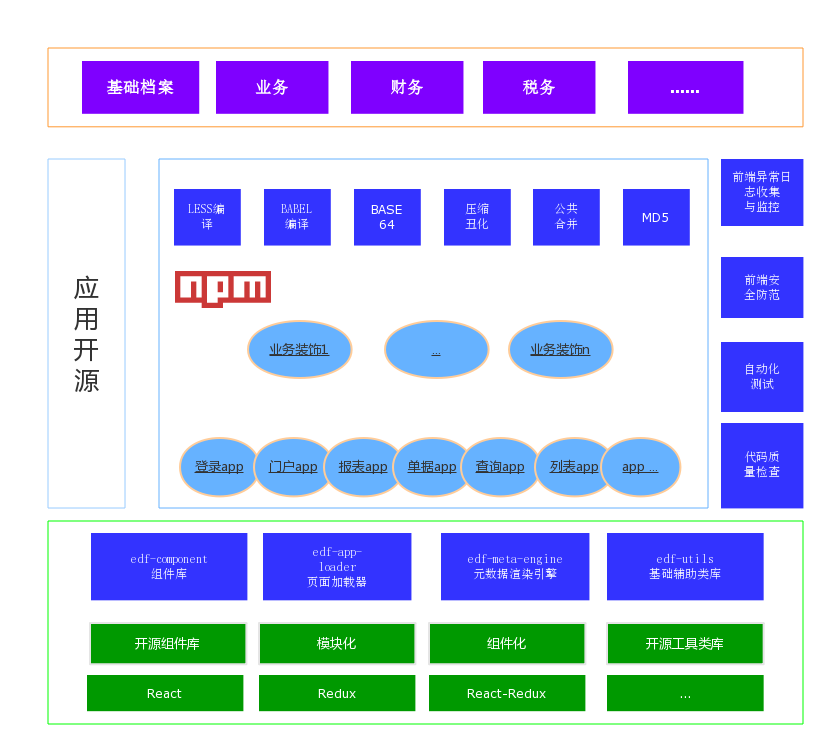

  

<h1>新手指南点这里：<a target='_blank'>https://www.kancloud.cn/test001001/ttk-guide/754594</a></h1>

  ### 命名来源：`TTK`是三国演义（The Three Kingdoms）的简称,它代表一支长期从事企业应用开发的团队。 ###
  ### 我们目标：为企业应用开发提供快速、高效、稳定的技术平台。  ###

  > 前端部分

  `ttk-app-core` [[github 地址请参见](https://github.com/thethreekingdoms/ttk-app-core)]是前端框架的核心模块。框架基于`React`、`Redux`核心技术,在该技术栈的基础上进行了功能改进。该框架简单易用、功能强大、风格统一、浏览器兼容、性能、稳定性等方面都有着很大的优势。

 

  > 后端部分

  整理中...
