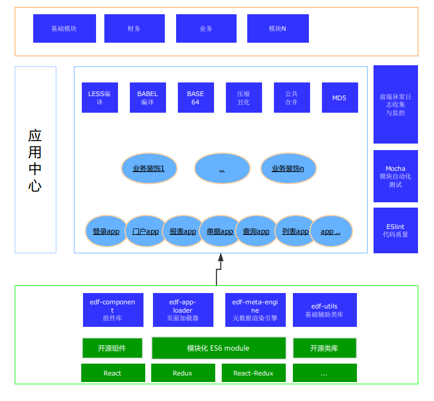

 

  
  

  
  
  

 

  ### 命名来源：TTK是三国演义（The Three Kingdoms）的简写,它代表一个团队，ttk-app-core是整个企业开发平台（TTK）中的前端框架部分。  ###

  ttk-app-core的诞生离不开 [ziaochina](https://github.com/ziaochina/) 开源项目以及其他开源软件，再次感谢为ttk-app-core开源项目付出的个人及组织。
 
  

