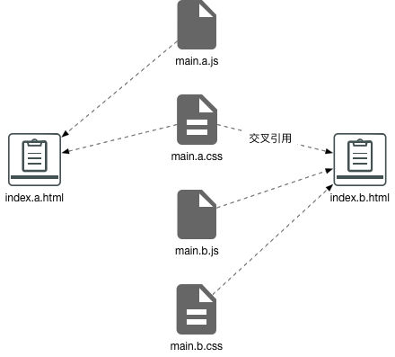

## 多页面开发

TTK支持多页面开发，并且对于单页面应用和多页面应用分别应用不同的资源定位策略。

### 单页面项目
单页面项目的含义是：
* 唯一的html入口文件 - `index.*.html`；
* 唯一的js主文件 - `dist.*.js`；
* 唯一的style主文件 - `style.*.css`。

对于单页面项目，TTK使用[html-webpack-plugin](https://doc.webpack-china.org/plugins/html-webpack-plugin/)的inject机制注入静态资源。你无须在html文件中创建引用静态资源的`<link>`和`<script>`标签。

比如单页面应用的html源文件内容如下：
```html
<!DOCTYPE html>
<html>
  <head>
    <title>webapp</title>
  </head>
  <body>
    <div id="app"></div>
  </body>
</html>
```

最终编译输出结果如下：
```html
<!DOCTYPE html>
<html>
  <head>
    <title>企业开发平台</title>
    <link href="/style/style.c5079e05.css" rel="stylesheet"></link>
  </head>
  <body>
    <div id="app"></div>
    <script type="text/javascript" src="/js/dist.c5079e05.js"></script>
  </body>
</html>
```

### 多页面项目
你可以使用[TTK脚手架](_scaffold.md)创建多页面项目，也可以将一个单页面项目改造成多页面，只需在项目中添加以下文件：
* 页面B的html入口源文件`index.<name>.html`；
* 页面B的js文件`main.<name>.<ext>`；
* 【可选】页面B的style主文件`main.<name>.<ext>`；

> 以上的`<name>`不要求同名，但是为了增强可读性，建议每个页面使用一致的命名。

[html-webpack-plugin](https://doc.webpack-china.org/plugins/html-webpack-plugin/)的inject是一种反向注入机制，这种机制的前提是在编译html文件之前必须知道它引用了哪些资源。单页面应用项目中的所有静态资源均属于当前页面，使用inject机制是没有问题的。但是对于多页面应用来说，各页面有不同的资源引用，甚至可能交叉引用。Webpack自身无法判断这种混合的引用关系。所以，我们将静态资源的引用交给了用户。

比如一个多页面应用中存在以下文件：
* 页面A和页面B的html入口文件`index.a.html`和`index.b.html`；
* 页面A和页面B的js主文件`main.a.js`和`main.b.js`；
* 页面A和页面B的style主文件`main.a.css`和`main.b.css`。

资源引用关系如下图所示：



我们不去讨论这种架构的合理性，事实上有很多老项目存在大量的交叉引用。对于存在交叉引用的资源，只有两种解决方案：
1. 在编译html之前获取引用关系，然后使用inject机制注入资源；
2. 在编译html过程中获取引用关系并替换引用地址。

第一种方案的实施也有两种方式：
1. 提供配置项给用户自行配置每个页面的依赖资源；
2. 由工具扫描html文件获取依赖资源。这种方式的问题在于，html由webpack编译，如果想在html编译之前获取到引用关系，必须在webpack编译之前进行。这便需要引入额外的流程和工具，不仅增加了复杂度，更打乱了构建工作流。

另外，如果交叉引用的资源存在先后顺序，比如`main.a.css`必须在`main.b.css`之前，inject机制无法处理这种需求。

所以，TTK最终采用了第二种方案解决这个问题。我们先看看这个例子最终的编译输出结果。`index.a.html`和`index.b.html`和源码内容分别如下：
```html
<!DOCTYPE html>
<!-- index.a.html -->
<html>
  <head>
    <title>webapp</title>
    <link href="main.a.css" rel="stylesheet"></link>
  </head>
  <body>
    <div id="app"></div>
    <script type="text/javascript" src="main.a.js"></script>
  </body>
</html>
```

```html
<!DOCTYPE html>
<!-- index.b.html -->
<html>
  <head>
    <title>webapp</title>
    <link href="main.a.css" rel="stylesheet"></link>
    <link href="main.b.css" rel="stylesheet"></link>
  </head>
  <body>
    <div id="app"></div>
    <script type="text/javascript" src="main.b.js"></script>
  </body>
</html>
```

最终编译输出的结果分别为：
```html
<!DOCTYPE html>
<!-- index.a.html -->
<html>
  <head>
    <title>企业开发平台</title>
    <link href="/style/main.a.c5079e05.css" rel="stylesheet"></link>
  </head>
  <body>
    <div id="app"></div>
    <script type="text/javascript" src="/webapp/js/main.a.378255e5.js"></script>
  </body>
</html>
```

```html
<!DOCTYPE html>
<!-- index.b.html -->
<html>
  <head>
    <title>webapp</title>
    <link href="/style/main.a.c5079e05.css" rel="stylesheet"></link>
    <link href="/style/main.b.12adf2w4.css" rel="stylesheet"></link>
  </head>
  <body>
    <div id="app"></div>
    <script type="text/javascript" src="/js/main.b.sdfe55e5.js"></script>
  </body>
</html>
```

以上的输出结果正是我们需要的。开发者唯一需要做的就是**在html源文件内添加link和script标签指明需要哪些资源引用**。

#### common&dll

如果通过[`ttk.spec('js',<options>)`](_config-js.md)配置了提取common模块或dll模块，则需在需要引入两者的html文件中创建对应的script标签：
```html
<script src="<appname>.dll.js" charset="utf-8"></script>
<script src="common.<appname>.js" charset="utf-8"></script>
```

> common模块是所有html文档均需要引入的。dll模块的引入与否根据业务代码决定。

其中`appname`是由[`basic`配置](_config-basic.md)指定。
